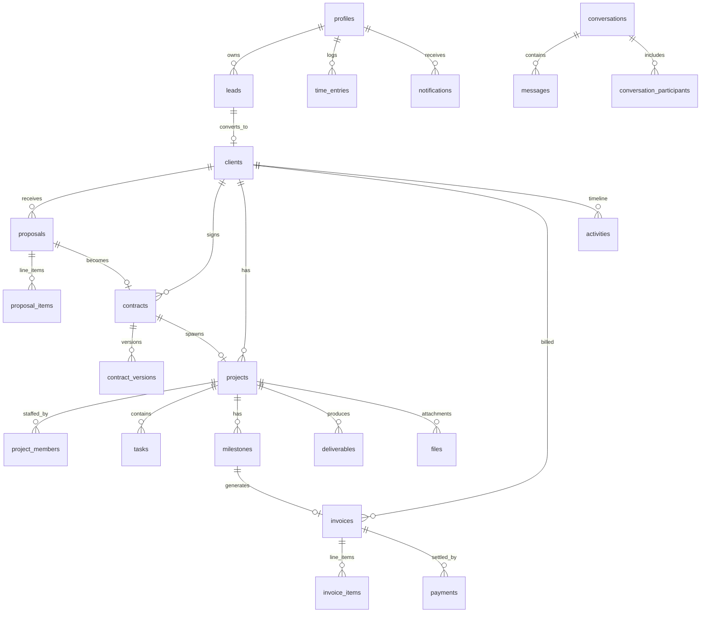

# AgencyOS Database

Full DDL in `supabase/migrations/00001_init.sql` (+ `00002_profile_protection.sql`).

## ER Diagram

## Security Model (RLS)
- Helper fns (SECURITY DEFINER): `current_user_role()`, `is_staff()`, `is_admin()`, `my_client_id()`, `rule_enabled()`.
- Staff full access to operational tables; finance (invoices/payments) restricted to owner+manager; members read assigned projects.
- Clients: read own data; write only proposal decisions, contract signatures, deliverable approvals, file uploads.
- Suspended users resolve to NULL role -> all access revoked instantly.
- `00002`: trigger blocks role/suspension changes by anyone but the owner.

## Automations
1. Signup -> profile (first user = owner)
2. Proposal accepted -> client created from lead, lead marked won
3. Contract signed -> project created (planning)
4. Billable milestone completed -> draft invoice + line item
5. Invoice items/payments changed -> totals + status recalculated
6. Daily cron: `mark_overdue_invoices()`, `notify_upcoming_deadlines()`
